# Architecture

```mermaid
graph TD
    Root["📁 Customer Support Ticket System (root)"] --> BE["📁 backend/"]
    Root --> FE["📁 frontend/"]
    Root --> Readme["📄 README.md"]

    BE --> App["📁 app/"]
    BE --> Scripts["📁 scripts/"]
    BE --> DataDir["📁 data/"]
    BE --> Eval["📁 evaluation/"]
    BE --> RAG["📁 rag_artifacts/"]
    BE --> Env["📄 .env"]
    BE --> Reqs["📄 requirements.txt"]

    App --> Main["📄 main.py"]
    App --> Config["📄 config.py"]
    App --> API["📁 api/"]
    App --> Core["📁 core/"]
    App --> Classifier["📁 classifier/"]
    App --> RAG2["📁 rag/"]
    App --> DB["📁 database/"]
    App --> Repos["📁 repositories/"]
    App --> Schemas["📁 schemas/"]
    App --> Prompts["📁 prompts/"]

    API --> Routes["📄 routes.py"]
    Core --> Pipeline["📄 pipeline.py"]
    Classifier --> Model["📄 model.py"]
    Classifier --> SVM["📄 svm_model.pkl"]
    Classifier --> TFIDF["📄 tfidf.pkl"]
    RAG2 --> Retriever["📄 retriever.py"]
    RAG2 --> Generator["📄 generator.py"]
    DB --> Base["📄 base.py"]
    DB --> Session["📄 session.py"]
    DB --> Models["📁 models/"]
    Models --> User["📄 user.py"]
    Models --> Query["📄 query.py"]
    Repos --> SupportRepo["📄 support_repository.py"]
    Schemas --> SupportSchema["📄 support.py"]
    Prompts --> GenPrompt["📄 generator_prompt.md"]

    Scripts --> Ingest["📄 ingest_knowledge.py"]
    Scripts --> NB["📄 M1_2.ipynb"]
    DataDir --> Clean["📄 clean.csv"]
    DataDir --> Raw["📄 raw.csv"]
    DataDir --> Cleaning["📄 cleaning.ipynb"]
    DataDir --> Analysis["📁 analysis/"]
    Eval --> EvalPy["📄 evaluate.py"]
    Eval --> TestQ["📄 test_queries.json"]
    Eval --> Results["📁 results/"]
    RAG --> Corpus["📄 knowledge_corpus.pkl"]
    RAG --> BM25["📄 bm25_by_type.pkl"]

    FE --> Src["📁 src/"]
    FE --> IndexHTML["📄 index.html"]
    FE --> ViteConfig["📄 vite.config.js"]
    FE --> Package["📄 package.json"]

    Src --> AppJSX["📄 App.jsx"]
    Src --> MainJSX["📄 main.jsx"]
    Src --> FormCSS["📄 Form.css"]
    Src --> IndexCSS["📄 index.css"]
    Src --> Pages["📁 pages/"]
    Pages --> ThankYou["📄 ThankYou.jsx"]
    Pages --> ThankYouCSS["📄 ThankYou.css"]
```

## Root-level items

| Path | Purpose |
|---|---|
| `backend/` | FastAPI application + data + scripts + evaluation |
| `frontend/` | React SPA (Vite) |
| `.gitignore` | Git ignore rules |
| `AGENTS.md` | Agent instructions for AI coding tools |
| `README.md` | Project overview and setup guide |
| `ARCHITECTURE.md` | This file — project architecture diagram |
| `skills-lock.json` | OpenCode skills metadata |
